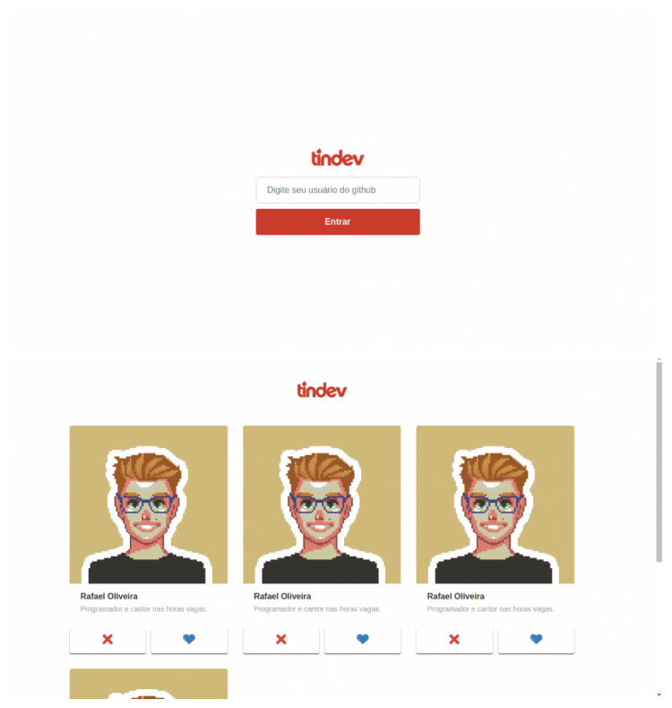

# tindev
Projeto realizado durante estudos de Node, tinder para desenvolvedores. [Em desenvolvimento]

<h1 align="center">
    
</h1>

## Execução 💻
 - Rodar os seguintes comandos, em ambas as pastas: backend e frontend. 
 	- npm install
	- npm start
	
